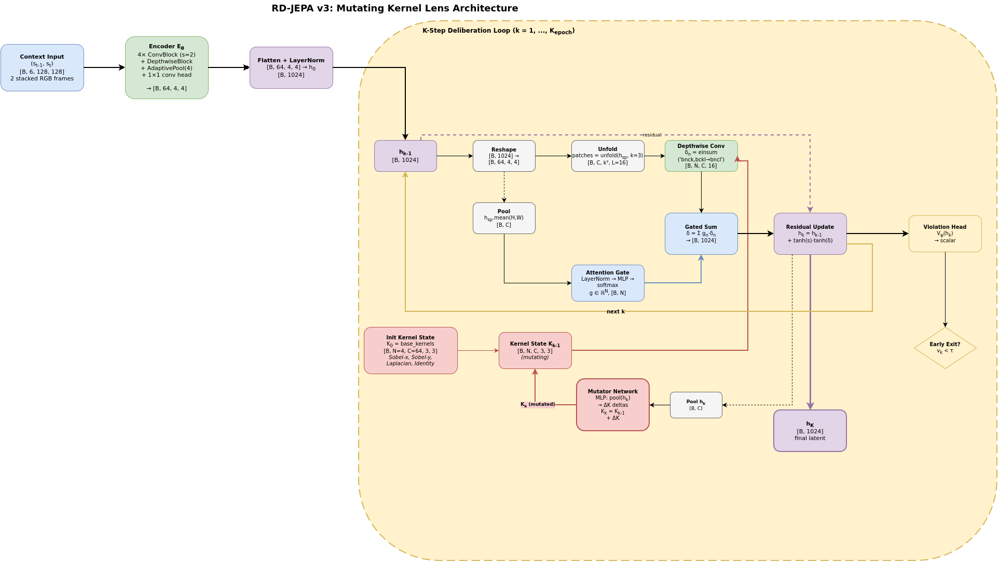

# RD-JEPA

A compact latent-space world model for rigid-body physics. Instead of predicting pixels directly, it refines a spatial latent representation by running a thinking loop: 4 depthwise convolution kernels that **evolve per-sample** over $K$ steps to carve away physical impossibilities. Built for consumer GPUs (8GB VRAM, tested on RTX 3070). Trained on Kubric MOVi-A.

<p align="center">
  
</p>
<p align="sub"><b>Figure 1.</b> The RD-JEPA v3 pipeline. A spatial latent
<b>[B, 64, 4, 4]</b> (flat 1024 externally) is refined <i>K</i> times by a
<b>Kernel Lens</b>, a bank of N=4 depthwise conv kernels that mutate
per-sample via a mutator network (test-time compute has real meaning: different
inputs → different kernel trajectories). An attention gate selects which
kernels to activate at each step. Energy, contrastive, divergence, and kernel-
diversity regularizers prevent mode collapse during BPTT. A separate
VizDecoder probes the frozen <i>h<sub>K</sub></i> for visualization without
entangling gradients with the thinking loop.
<a href="docs/architecture.svg">SVG</a> · <a href="docs/architecture.drawio">source</a></p>

---

## How it works

Most world models rebuild the scene from scratch at each timestep. RD-JEPA keeps a spatial latent representation and **refines it in place** by iteratively applying learned convolution kernels. Each kernel adapts per-sample (different inputs → different kernels), so the "refinement" is actually meaningful computation, not a fixed function repeated $K$ times.

The loop terminates early when the model is confident (< 0.1 violation score), so easy predictions stop at ~2 steps while hard collisions run the full 15. VRAM stays constant regardless of $K$ because the kernels are weight-shared (only activations grow, and gradient checkpointing keeps those in check).

### v3 improvements

- **Depthwise conv kernels instead of MLPs**: spatial inductive bias, ~0.33M params vs 4.4M in v2
- **Per-sample kernel mutation**: the kernels evolve based on the latent, not static
- **Attention gate instead of MoE router**: lightweight and stable
- **Asynchronous decoder**: RGB visualization without polluting gradients
- **Grounded training signal**: MOVi's per-frame collision force for the violation head

The result: **test-time compute that actually computes** (different inputs produce different refinement trajectories).

## Architecture

**Encoder** ($E_\theta$): stacked context frames $(s_{t-1}, s_t)$ → spatial latent $h_0 \in \mathbb{R}^{B \times 64 \times 4 \times 4}$. Lightweight 4-layer CNN + ConvNeXt-style depthwise block. An EMA copy produces stop-gradient targets (BYOL-style).

**Kernel Lens** ($K$ steps): 
1. **Depthwise convolution**: each of 4 kernels $K_n \in \mathbb{R}^{64 \times 3 \times 3}$ is applied per-sample to the spatial latent via unfold+einsum
2. **Attention gate**: lightweight MLP selects which kernels to activate
3. **Residual update**: gated sum added back to latent
4. **Kernel mutation**: mutator network reads the updated latent and evolves each kernel for the next step

Kernels are seeded with Sobel-x, Sobel-y, Laplacian, identity filters.

**Violation head** ($V_\psi$): predicts "physical error" on the latent. If score < 0.1, loop exits early. Trained on grounded collision forces from MOVi.

**VizDecoder** (separate optimizer): 4 deconv blocks decode $h_K$ to RGB for visualization, detached from JEPA gradients.

## Training

**Losses** (balance prevents mode collapse):

| Loss | Weight | Notes |
|---|---|---|
| JEPA (final-only MSE) | 1.0 | predict $h_K$ from target |
| Energy conservation | 0.1 | prevent zeroing latent magnitude |
| Contrastive dynamics | 0.05 | penalize stasis when collision exists |
| Divergence regularization | 0.05 | constant per-step density |
| Violation aux | 0.01 | monotonic exit score |
| Violation grounded | 0.1 | predict collision force (grounded signal) |
| VICReg (var + cov) | 1.0 / 1.0 | collapse safety |
| Kernel diversity | 0.01 | prevent filter duplication |

**Memory budget** (8GB VRAM):

- Gradient checkpointing inside the $K$-loop (on by default)
- Weight sharing: one kernel bank reused all $K$ steps
- BF16 autocast on Ampere
- $K$-independent VRAM: activations scale linearly in $K$, not weights

**Curriculum**: $K$ ramps from 1 → 15 over first 5 epochs to stabilize training.

## Getting started

### Setup

```bash
uv sync  # Python 3.11 (single env, PyTorch + tfrecord)
```

### Data

Download MOVi-A from tfds and convert to .npz caches (RGB + violation_gt grounded signal):

```bash
uv run python scripts/build_data.py                    # full train + dev
uv run python scripts/build_data.py --max-shards 10   # quick test
uv run python scripts/build_data.py --dev-only         # dev split only
```

### Train

```bash
uv run python scripts/train.py                    # defaults (8GB-friendly)
uv run python scripts/train.py --exp-name big --epochs 40 --batch-size 256
uv run python scripts/train.py --fast              # 500-sample smoke test
```

All config fields are CLI overrides (kebab-case). Run `--help` to see options. Metrics go to Aim:

```bash
aim up
```

### Develop

```bash
uv run ruff check . --fix   # lint + fix
uv run pytest               # 22 tests, CPU-only
uv run mypy rd_jepa/        # type check
```

## Project structure

```
rd_jepa/
  config.py              Config dataclass + curriculum_K
  losses.py              JEPA + energy + contrastive + divergence + VICReg + diversity
  train.py               train_step / eval_step / train
  data/loader.py         MOVi transition dataset (v3 .npz)
  models/
    rd_jepa.py           RDJEPA: encoder → K-step loop → early exit
    deliberation.py      KernelLens (mutating kernels) + ViolationHead
    encoder.py           spatial CNN
    ema.py               EMA target encoder
  eval/
    probe.py             linear probe on violation target
    probe_module.py      ViolationProbe (MSE / R²)
  viz/
    decoder.py           VizDecoder (async probing)
    gif_writer.py        deliberation + rollout gifs
    aim_logger.py        Aim logging
scripts/
  build_data.py          MOVi tfds → .npz + CLI
  train.py               easy entry point
tests/
  test_movi_pipeline.py  22 tests
docs/
  architecture.drawio    diagram source
  architecture.png       rendered
  architecture.svg       web-friendly
data/cache/              .npz caches
runs/                    checkpoints + outputs
```

## License

See [LICENSE](LICENSE).
